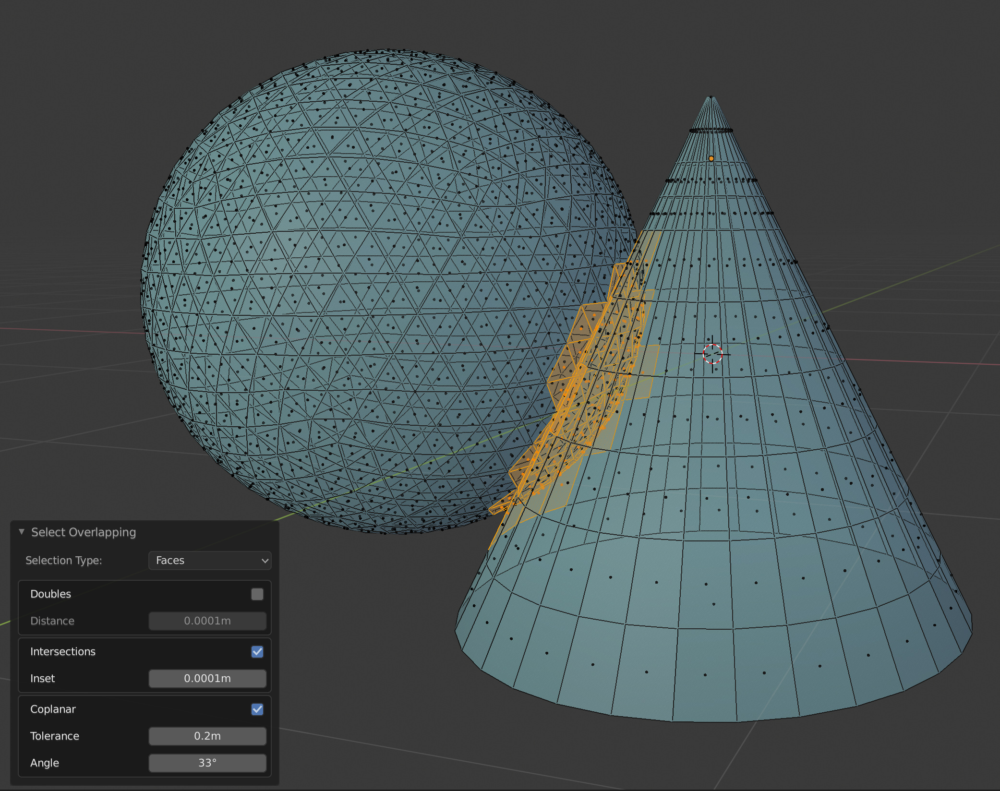
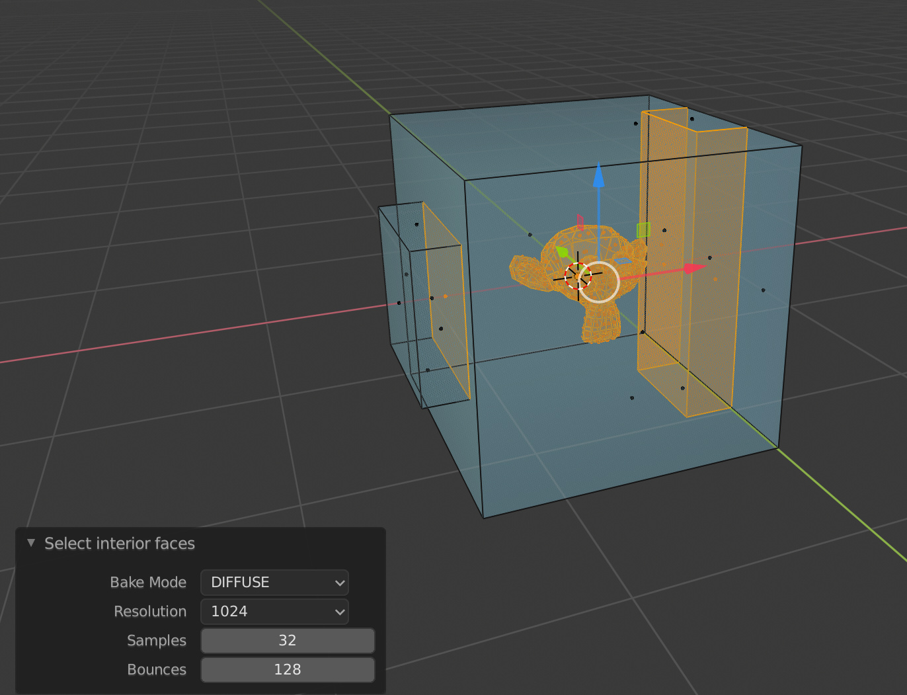

# mesh-utils 

  <a href="https://twitter.com/radu_popovic?ref_src=twsrc%5Etfw" class="twitter-follow-button" data-show-count="false">Follow @radu_popovic</a>

## Up to date list of tools:
- select overlapping based on KDTree/BVHTree
- select interior faces based on AO map baking
- select CREASE/BEVEL/SEAM/SHARP/FREESTYLE by trait instead of similarity(doesn’t require edge preselect)
- mesh from UVs

### Select overlapping geometry

I wrote this addon because blender has no proper way of detecting intersecting/overlapping geometry. The tool is context sensitive to VERT/EDGE/FACE mode.
Implementation wise, the algorithm used here is based on KDTree or BVHTree as an alternative. KDTree is used for vertex, edge and face duplicate detection and BVHTree is used for face intersecting/overlapping only.
Unfortunately, in blender BVHTree implementation is working properly only with face intersections while epsilon=0.0. Any other scenario is not detected properly.
Exceptional use cases for BVHTree:
- co-planar intersections are not detected
- face inside face not detected
- works better with triangles
- false positive with adjacent faces

So, in order to overcome these limitations I came up with an idea on how to avoid these scenarios altogether. 
How it works:
- Clone the original mesh
- Determine the average edge length
- Calculate minimal inset threshold + edge clamping
- Edge split all faces
- Inset individual faces by calculated inset threshold. This is done to avoid adjacent false positive detection.
- Delete newly created geometry as a result of insetting
- Run BVHTree.ovelap() against original mesh
- Exclude intersection pairs with same index because these are false positive as result of cloning
- Find coplanar faces with BVHTree.find_nearest_range()

These two implementations KDTree/BVHTree can be used together or separately in face mode.

### Select interior faces (AO bake)

This solution is based on AO map baking. Normaly you would want to do a “bake to vertex” but this is not possible right now in b2.8. So, I am baking to image and then I am interpolating face/vertex position inside the UV map. Everything completely black in the AO map is hidden behind some geometry.
For some reason, the baker is leaking light sometimes in areas where it should not be. You might get some false selection here. I am still trying to figure this one out.

### FAQ

#### Why do I need this?
It's very useful in boolean workflows. When you have lots of slices and ugly n-gon intersections you want to quickly get rid of, but it can be used with any kind of intersecting geo.

#### What is wrong with "Remove Double Vertices"?
Nothing. Remove double vertices is usually to limited for most use case scenarios when you are dealing with intersecting geo.

#### How is this better than 3D Print Toolbox plugin?
Their implementation is based only on vanilla BVHTree implementation and it's not accounting for exceptional cases. So, it's going to give you bad results most of the time.

#### What limitations?
With KDTree, in face mode I am using weighted median point to exclude adjacent false positives. This might fail in some extreme cases when the median point is not not in "distance" range or it's overlapping with another duplicated inside polygon.
With BVHTree, the only limitation is related to the fact that I am insetting inward by infinitesimal amount.

#### How fast it is?
As fast as it can get. It's limited only by KDTree/BVHTree performance.

#### Why AO map baking?
Select interior faces could be implemented using the following techniques:
- octree sampling. result is dependent on the resolution of the octree
- Boolean intersection. Broken in blender 2.8
- AO bake. baking has some advantages over the other solutions listed here. One of them is the fact that is not modifing the original mesh and it's able to identify "invisible" geometry

#### Where do I get it from?
https://github.com/rpopovici/blender-addons

